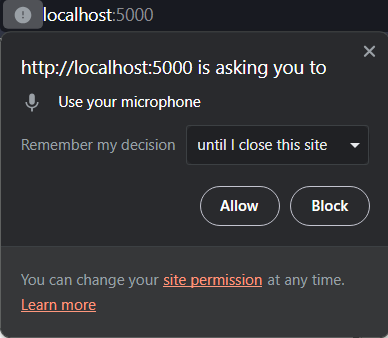

# PWA ChatBot Recording

This is a simple chatbot with voice recording functionality, built as a Progressive Web App (PWA).

## Table of Contents

- [Introduction](#introduction)
- [Features](#features)
- [Installation](#installation)
- [Usage](#usage)


## Introduction

This project is a PWA that incorporates a chatbot with voice recording facility. Users can use the chatbot to record audio messages, and play them back. They can even record multiple voices and play them back

## Features

- Chatbot use with voice recording, play back.
- User-friendly interface.
- Responsive design for various devices.

## Installation

1. Clone the repository:

   ```bash
   git clone "https://github.com/arpit2k2gen/PWA-CHATBOT"
   ```
2. Make sure to you have python installed in your machine.
3. if flask is not installed you may install it by running ```pip install flask```


## Usage
1. After successfully cloning the repository, open the folder in VS CODE.
2. Open the terminal and enter the command ```python app.py```.
3. The application would be running on ```localhost:5000```.

4. Make sure to give the access for microphone to the application.

5. You can now Record your voice, playit back 

6. You can even record multiple voices and play them back by clicking on the voice message itself. 


##Thanks.
##Arpit Kaushal - Developer - [My Github](https://github.com/arpit2k2gen)